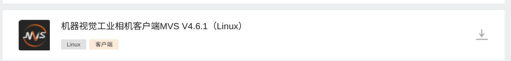

# MAS Vision - 机器人自动瞄准视觉系统

## 🛠️ 开发环境搭建

### 依赖库安装

#### 1. 基础开发工具

```bash
sudo apt-get update
sudo apt-get install -y \
    cmake build-essential ninja-build git pkg-config libssl-dev \
    clang clangd clang-format libspdlog-dev libeigen3-dev  libgtk2.0-dev \
    libsdl2-2.0-0 libsdl2-dev libsdl2-image-2.0-0 libsdl2-image-dev  \
    libsdl2-ttf-2.0-0 libsdl2-ttf-dev libopencv-dev
```

### 2. usb相机调试
```bash 
sudo apt install guvcview
```

#### 3. hikvision （海康相机驱动）

[驱动下载](https://www.hikrobotics.com/cn/machinevision/service/download/?module=0)

``` bash
//下载完成以后，直接解压，安装MVS-xxx_x86_64_xxx.deb (由于版本号可能不一样，只需要安装x86_64架构的安装包即可)
sudo dpkg -i MVS-4.6.1_x86_64_20251217.deb 
```
#### 4. yaml-cpp 安装
```bash
git clone https://gitee.com/mirrors/yaml-cpp.git
cd yaml-cpp
mkdir build && cd build
cmake ..
make -j8
sudo make install
```
#### 5.nlohmann-json 安装
```bash
git clone https://gitee.com/mirrors/nlohmann-json.git
cd nlohmann-json
mkdir build && cd build
cmake ..
make -j8
sudo make install
```

### 编译和构建

``` bash
mkdir build && cd build
cmake ..
make -j8
```

### 运行应用

```bash
# 从构建目录运行
cd build
./base
```

## 📋 项目 TODO

- [x] **硬件驱动**
  - [x] hikcamera驱动 (参考 海康SDK example示例)
  - [x] 串口驱动（[同济25开源](https://github.com/TongjiSuperPower/sp_vision_25)）
  - [x] usb_camera驱动
- [x] **rm_utils**
  - [x] 日志工具 （开源项目[spdlog](https://github.com/gabime/spdlog)）
  - [x] 线程池（开源项目[BS_thread_pool](https://github.com/bshoshany/thread-pool)）
  - [x] 一对一线程消息队列（开源项目[SPSCQueue](https://github.com/rigtorp/SPSCQueue)）
  - [x] sdl2显示工具
  - [x] udp消息发送（[同济25开源](https://github.com/TongjiSuperPower/sp_vision_25)）
- [ ] **Armor_detector**
  - [x] 装甲板检测([同济25开源](https://github.com/TongjiSuperPower/sp_vision_25) [中南24开源](https://github.com/CSU-FYT-Vision/FYT2024_vision))
  - [ ] 装甲板位姿解算
  - [ ] 整车观测模型
  - [ ] 装甲板追踪
  - [ ] 弹道解算及火控
- [ ] **Buff_detector**
  - [ ] 大符单扇叶检测
  - [ ] 大符位姿解算
  - [ ] 大符整体观测模型
  - [ ] 大符追踪
  - [ ] 弹道解算及火控
...

## 🤝 贡献指南

欢迎提交 Issue 和 Pull Request！
